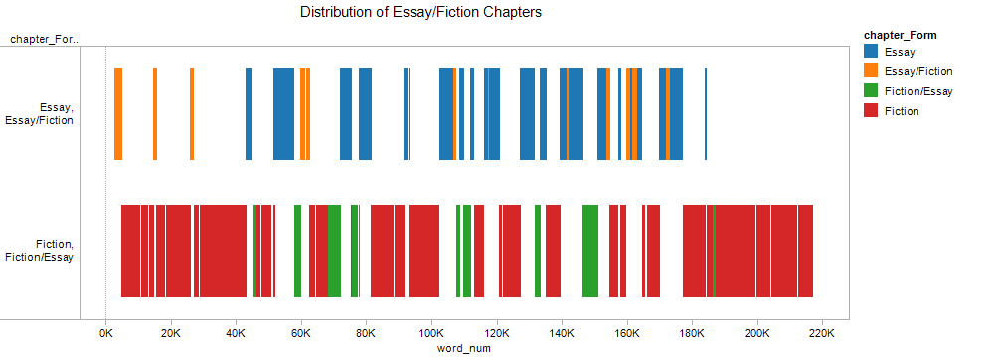
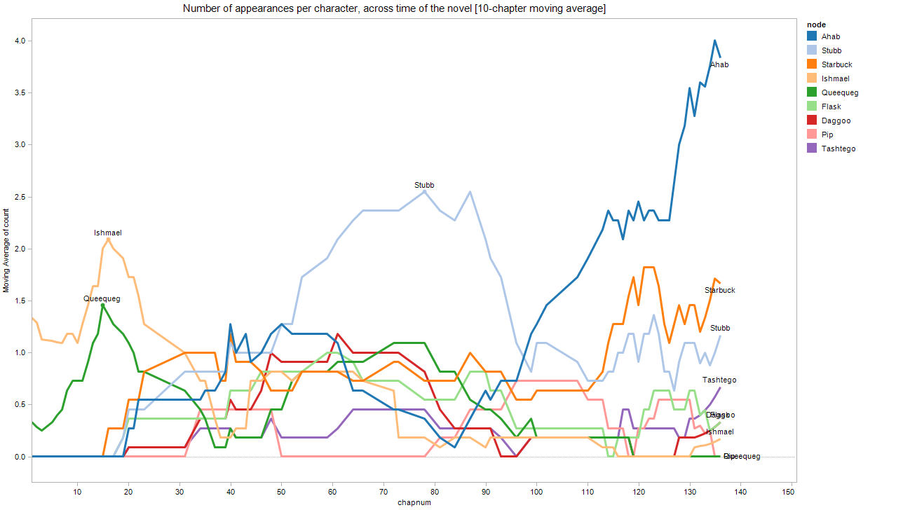
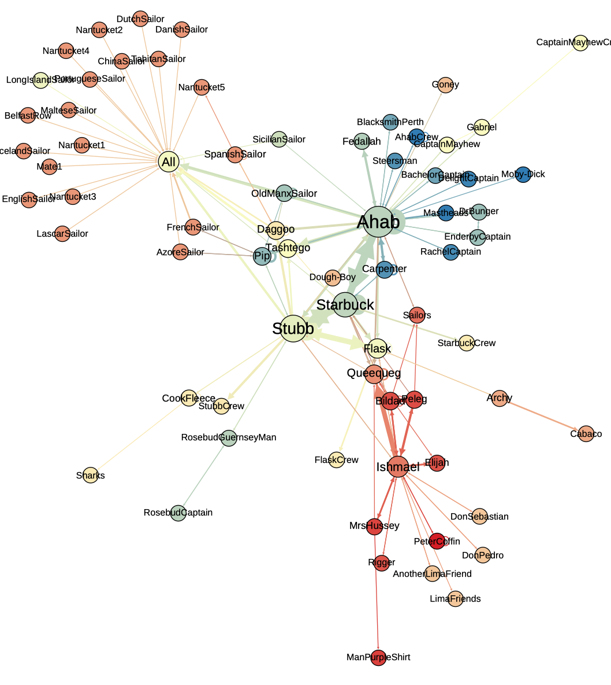
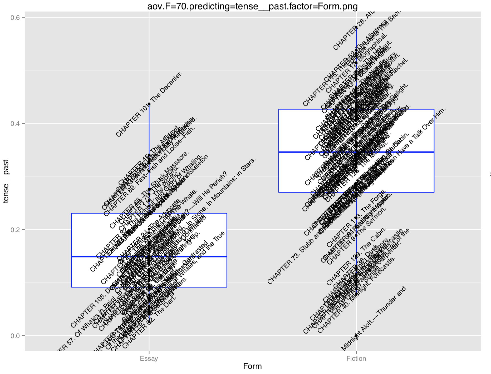
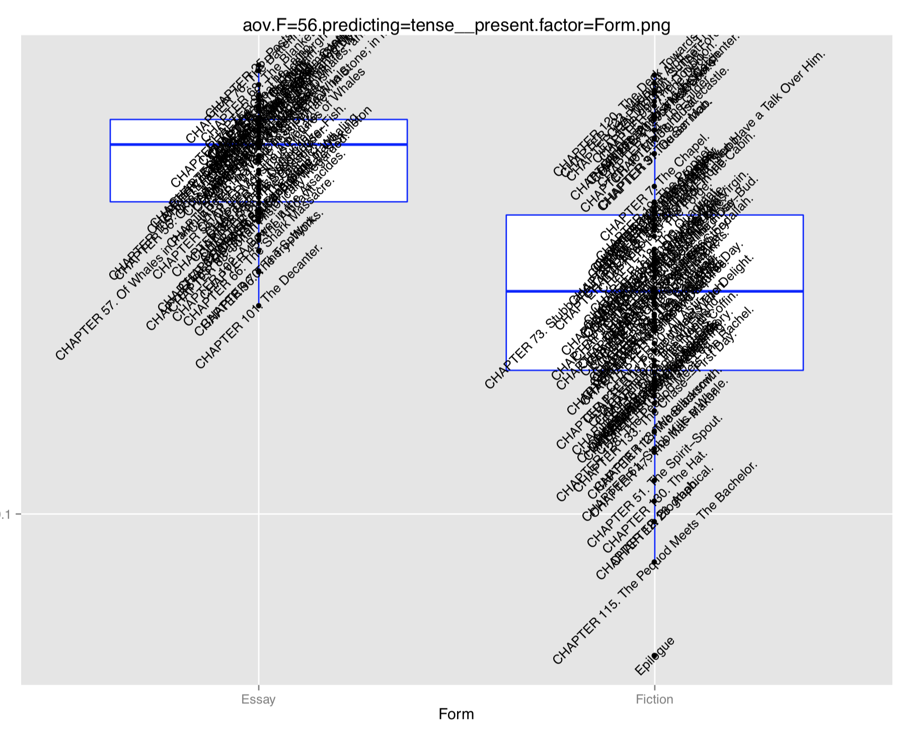
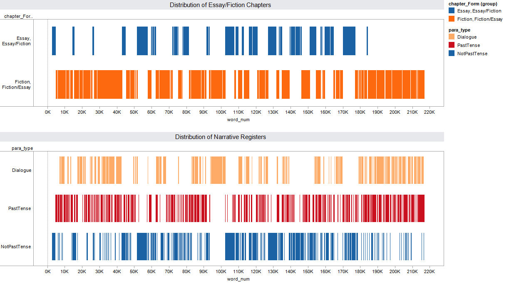

# (2A) Introduction to corpora

## What is a corpus?

Taken from the Latin for "body," a "corpus" [originally meant](http://www.oed.com.stanford.idm.oclc.org/view/Entry/41873?redirectedFrom=corpus#eid) the "body of a man or animal" (1440); in 1728 we find its literary meaning, as "the whole body of literature on any subject"; and by 1956 its linguistic one, as "body of written or spoken material upon which a linguistic analysis is based." 

A [corpus](https://en.wikipedia.org/wiki/Text_corpus) is a structured set of texts, and [corpus linguistics](https://en.wikipedia.org/wiki/Corpus_linguistics) is the empirical study of real-world language, whether written or spoken, as collected into corpora.

A corpus is more than the sum of its parts: it not only includes texts but also knows something about them. In other words, it combines text data with **metadata**: data about data.

## Examples

### The Brown Corpus

Developed in 1961 at Brown University, the [Brown Corpus of Standard American English](https://en.wikipedia.org/wiki/Brown_Corpus) is the [first](https://www1.essex.ac.uk/linguistics/external/clmt/w3c/corpus_ling/content/corpora/list/private/brown/brown.html) digital linguistic corpus. It is extremely well-studied and still in use today. Compilers Henry Kučera and W. Nelson Francis subjected the corpus to a variety of computational analyses before publishing their results in *Computational Analysis of Present-Day American English* (1967), a foundational text in the discipline of corpus linguistics.

The Brown corpus includes 500 texts, all published in 1961. From each text it takes 2,000 words, yielding a corpus total of [one million words](https://gph.is/1sV3uRP). These 500 texts were divided into 15 categories:

* A. PRESS: REPORTAGE (44 texts)
* B. PRESS: EDITORIAL (27 texts)
* C. PRESS: REVIEWS (17 texts)
* D. RELIGION (17 texts)
* E. SKILL AND HOBBIES (36 texts)
* F. POPULAR LORE (48 texts)
* G. BELLES-LETTRES (75 texts)
* H. MISCELLANEOUS: GOVERNMENT & HOUSE ORGANS (30 texts)
* J. LEARNED (80 texts)
* K. FICTION: GENERAL (29 texts)
* L. FICTION: MYSTERY (24 texts)
* M. FICTION: SCIENCE (6 texts)
* N. FICTION: ADVENTURE (29 texts)
* P. FICTION: ROMANCE (29 texts)
* R. HUMOR (9 texts)

In doing so, the Brown corpus enables cross-categorical comparison as well as a greater robustness to generalizations about "present-day American English."

The Brown Corpus is therefore not a random assortment of snippets of language, but was carefully curated in order to allow the answering of specific research questions about language.

More comprehensive information about the corpus can be found in the [Brown Corpus Manual](http://clu.uni.no/icame/manuals/BROWN/INDEX.HTM).

### Other Linguistic Corpora

| Corpus      | Genres        | Years    | # words |
| ------      | ------        | -----    | ------- |
| British National Corpus | [Multiple/Balanced](https://en.wikipedia.org/wiki/British_National_Corpus#/media/File:British_National_Corpus_structure.svg) | [1960-1995](https://books.google.com/books?id=CMyPT-nDm4sC&pg=PA119&lpg=PA119&dq=british+national+corpus+timespan&source=bl&ots=8BM5ej1izp&sig=ACfU3U0KY8eyksTmEI06-UZEIfUddnV53A&hl=en&sa=X&ved=2ahUKEwiihtXbpavhAhWNu54KHQKnAkoQ6AEwBXoECBoQAQ#v=onepage&q=british%20national%20corpus%20timespan&f=false) | 100 million | ? |
| Corpus of Contemporary American English (COCA) | Multiple/Balanced | 1990-2017 | 560 million |
| Corpus of Historical American English (COHA) | Fiction, Newspaper, Magazine, Non-Fiction | 1800-2009 | 400 million |

For a fuller list, see the collaborative [Corpus Library](https://docs.google.com/spreadsheets/d/1DaM0b9ut03fQWkP6lcfbuUnTjyJzDEe3NtiDwHGGNo4/edit?usp=sharing).

### Literary Corpora

Here are some literary corpora to which we have access. See a more complete list in the next module, [(2B) Build a corpus](2B_building_a_corpus.md).

| Corpus           | Genres            | range     | num_texts | desc                                                                             |
|------------------|-------------------|-----------|-----------|----------------------------------------------------------------------------------|                                                  
| ChadwyckPoetry   | Poetry            | 1473-2000 | 336,180   | Chadwyck-Healey Poetry Collections                                               |
| EEBO_TCP         | Multiple          | 1474-1699 | 56,351    | Early English Books Online (curated by the Text Creation Partnership)            |
| Chadwyck         | Fiction           | 1582-1899 | 1,338     | Chadwyck-Healey Fiction Collections                                              |
| ECCO_LitLang     | Multiple          | 1700-1799 | 43,207    | Eighteenth Century Collections Online (Literature and Language section)          |
| OldBailey        | Court Transcripts | 1720-1913 | 637       | Old Bailey Online                                                                |
| DialNarr         | Fiction           | 1825-1945 | 1,918     | Separated Dialogue and Narration Portions of Chadwyck-Healey Novels              |
| Chicago          | Fiction           | 1880-2000 | 9,089     | The University of Chicago Corpus of Twentieth Century Novels                     |

## Our Class Corpora

### 1) The 49 Chapters of Karen Yei Tamashita's *Tropic of Orange* (1997)

This is the "metadata" given to us right away in the first few pages of the book. The table of contents records all of the following information except the narrator, whose patterned reappearances are marked in a separate table.

| fn       | part | part_day  | part_title              | chapter | chapter_title          | setting                        | narrator          |
|----------|------|-----------|-------------------------|---------|------------------------|--------------------------------|-------------------|
| ch01.txt | 1    | Monday    | Summer Solstice         | 1       | Midday                 | Not Too Far From Mazatlán      | Rafaela Cortes    |
| ch02.txt | 1    | Monday    | Summer Solstice         | 2       | Benefits               | Koreatown                      | Bobby Ngu         |
| ch03.txt | 1    | Monday    | Summer Solstice         | 3       | Weather Report         | Westside                       | Emi               |
| ... | ...    | ...   | ...            | ...       | ...                | ...     | ...               |
| ch47.txt | 7    | Sunday    | Pacific Rim             | 47      | To Die                 | Pacific Rim Auditorium         | Arcangel          |
| ch48.txt | 7    | Sunday    | Pacific Rim             | 48      | Hour 25                | Into the Boxes                 | Buzzworm          |
| ch49.txt | 7    | Sunday    | Pacific Rim             | 49      | American Express       | Mi Casa/Su Casa                | Bobby Ngu         |

This metadata is [in our repository](corpora/tropic_of_orange/metadata.xls), as well as [on Google Drive](https://docs.google.com/spreadsheets/d/1cRmrwQmq2HuA-cb_mQYGGau40AO9fAROqRUK4EKKoJ4/edit?usp=sharing). As we read, we will collaboratively expand our corpus metadata.

#### Discussion

What kinds of questions would this corpus enable, as-is? Which pieces of metadata allow for meaningful literary critical questions?

### 2) Literature and Language in the 1990s

A sample from the Corpus of Historical American English.

| author                   | title                                                                   | year | genre       | note                                                    | num_words | ocr_accuracy | textID |
|--------------------------|-------------------------------------------------------------------------|------|-------------|---------------------------------------------------------|-----------|--------------|--------|
| Taylor-Hall, Mary Ann    | One Main Sound                                                          | 1990 | Fiction     | Ploughshares:: Winter90/91, Vol. 16 Issue 4, p46, 12p:  | 4680      | 99%          | 53162  |
| Driscoll, Jack           | Killing time                                                            | 1990 | Fiction     | Ploughshares:: Winter90/91, Vol. 16 Issue 4, p159, 13p: | 4985      | 99%          | 53163  |
| Henley, Patricia         | Same old big magic                                                      | 1990 | Fiction     | Ploughshares:: Winter90/91, Vol. 16 Issue 4, p193, 5p:  | 1396      | 97%          | 53164  |
| …                        | …                                                                       | …    | …           | …                                                       | …         | …            | …      |
| Markar Melkonian         | Richard Rorty's Politics: Liberalism at the End of the American Century | 1999 | Non-Fiction | Humanity Books, Amherst                                 | 38042     | 98%          | 773781 |
| Gregory N. Derry         | What Science is and How it Works                                        | 1999 | Non-Fiction | Princeton University Press, Princeton, NJ               | 23576     | 99%          | 773819 |
| Marcia B. Baxter Magolda | Creating Contexts for Learning and Self-Authorship                      | 1999 | Non-Fiction | Vanderbuilt University Press, Nashville                 | 21125     | 99%          | 773549 |

#### Discussion

What kinds of questions would this corpus enable?

### Deep Reading (Corpora)

These critical questions are interesting, if limited. What other meaningful categories is our metadata missing?

How can we "deep read" the novel, annotating its form and 

## Example project: *Moby-Dick* and Essayism

In a seminar paper I wrote in 2014, I was interested in analyzing the infamous tension in Herman Melville's *Moby-Dick* between its chapters of exciting story (hunting through the entire ocean! to kill a single whale! for revenge!) and the dense, encyclopedic chapters (describing whale anatomy and blubber). I wanted to produce data that would let me answer questions like:

* Empirically, how linugistically different are these "fiction" and "essay" chapters? What does corpus linguistics, which studies fictional and essay "registers" (e.g. in the Brown corpus) in the world, have to say about how these registers function *inside the novel?*

* Which linguistic features are most strongly associated with "fiction" or "essay" chapters?

* Is the chapter the right unit for this linguistic contrast, or are "fiction" and "esay" linguistic *modes* that alternate more fluidly and independently of chapters?

As I read the book, I ended up annotating this information ([and more]()):

| fn      | Chapter                             | Form          | Dialogue | Network                                                                                                                                          |
|---------|-------------------------------------|---------------|----------|--------------------------------------------------------------------------------------------------------------------------------------------------|
| 003.txt | CHAPTER 1. Loomings.                | Essay/Fiction | No       | Ishmael                                                                                                                                          |
| 004.txt | CHAPTER 2. The Carpet-Bag.          | Fiction       | No       | Ishmael                                                                                                                                          |
| 005.txt | CHAPTER 3. The Spouter-Inn.         | Fiction       | Yes      | Ishmael<>PeterCoffin; Bulkington; Queequeg; Queequeg>Ishmael                                                                                     |
| …       | …                                   | …             | …        | …                                                                                                                                                |
| 134.txt | CHAPTER 132. The Symphony.          | Fiction       | Yes      | Ahab<>Starbuck; Ahab>Ahab                                                                                                                        |
| 135.txt | CHAPTER 133. The Chase--First Day.  | Fiction       | Yes      | Ahab<>Daggoo; Ahab<>Tashtego; Stubb<>Ahab; Stubb<>Starbuck                                                                                       |
| 136.txt | CHAPTER 134. The Chase--Second Day. | Fiction       | Yes      | Ahab>Mastheads; Stubb>Stubb; Ahab<>Starbuck; Carpenter>Ahab; Stubb<>Ahab                                                                         |
| 137.txt | CHAPTER 135. The Chase--Third Day.  | Fiction       | Yes      | Ahab<>Mastheads; Starbuck>Starbuck; Ahab<>Starbuck; Ahab>Moby-Dick; Ahab<>AhabCrew; Ahab>Fedallah; Ahab<>Flask; Ahab>Tashtego; AhabCrew>AhabCrew |
| 138.txt | Epilogue                            | Fiction       | No       | Ishmael                                                                                                                                          |

### Questions answered

Which questions were able to be answered using this metadata?

#### Questions answered using metadata about chapter genre

* **Q:** How many essay chapters are there vs. how many fiction chapters?

* **A:**  

----

* **Q:** Where in the novel do they take place?

* **A:**  

----

#### Questions answered using metadata about characters

* **Q:** When are characters most prevalent in the novel? Do character trends show a division of the novel into thirds, as is sometimes argued?

* **A:**  

----

* **Q:** What social network do the characters form, using annotated interactions?

* **A:**  

#### Questions answered using text mining in addition to metadata

* **Q:** Which linguistic feature best distinguishes fiction from essay chapters?

* **A:** Prevalence of past tense marked fiction; a prevalence of present tense marked the essay.

	* % Verbs past tense: 
	* % Verbs present tense: 

----

* Q: Is the chapter the right unit for this linguistic contrast, or are "fiction" and "esay" linguistic *modes* that alternate more fluidly and independently of chapters?

* **Q:** Where are past and present tense verbs—the linguistic markers of fiction and essay chapters—prevalent in *paragraphs* of the novel, irrespective of their chapter type?

* **A:**   

## A corpus is a question

Every corpus asks a question.

### Politics of corpora

No corpus is neutral. If a corpus is a question, it keeps with it the circumstances of its asking. It has a desire to it, a goal, even if vague.

This also means that the creation of a corpus is a social and political act. ["Raw" data is an oxymoron](https://mitpress.mit.edu/books/raw-data-oxymoron): every corpus is shaped by human choices in a specific social environment.

When a corpus asks a question, who's included in that question? Who's excluded? 

Who is represented in the corpus? Who is erased? At the same time, a well-designed corpus can help to reveal who has been excluded.1

<small>1. For a deeper exploration of these questions, see Lauren Klein, [“The Image of Absence: Archival Silence, Data Visualization, and James Hemings,” American Literature, 85 (2014), 661–88](http://dx.doi.org/10.1215/00029831-2367310)”</small>

### Philosophy of corpora

What does a corpus represent? What can we say of a corpus like "All Short Stories published in the *New Yorker*" that we can't say of a corpus like "One Hundred Short Stories I Found By Googling"? Are both "Short Story" corpora?2

<small>2. If you're interested, for more on these questions see Katherine Bode's recent article, ["The Equivalence of Close and Distant Reading"](https://read-dukeupress-edu.stanford.idm.oclc.org/modern-language-quarterly/article/78/1/77/19924/The-Equivalence-of-Close-And-Distant-Reading-Or), which makes a strong case for taking these questions extremely seriously.</small>

### Statistics of corpora

From a statistical perspective, corpus design often aims to enable a motivated comparison: fiction vs. non-fiction, for instance. The COHA corpus, for instance, balances the number of texts in each decade across fiction, non-fiction, newspapers, and magazines. 

### Principles of corpus design

[See here](https://ota.ox.ac.uk/documents/creating/dlc/chapter1.htm) for a more thorough discussion of the principles of corpus design from a corpus linguistics perspective.

## Next: [(2B) Building a corpus](2B_building_a_corpus.md)